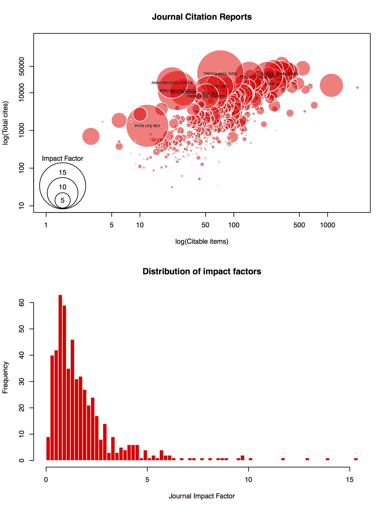

  
4 - 8 November 2019, CIBIO/InBIO, Vairão

##COURSE EVALUATION

In pairs, choose and write code to reproduce at least one of the graphs below. The data needed are available [**here**](https://phenoevo.github.io/Intro2R/evaluation/plot-data.zip)

```{r, echo=FALSE, out.width="30%", out.height="20%", fig.cap=c(1, 2, 3), fig.show='hold', fig.align='center'}
knitr::include_graphics(c("evaluation/plots/1.png", "evaluation/plots/2.png", "evaluation/plots/3.png"))
```

[](https://phenoevo.github.io/Intro2R/evaluation/plots/1.png)




Some specific instructions for each graph:

**Plot 1: Temperature anomaly (1950-1980)**

  + Data: CRU_data.txt

  + Hint: temperature anomaly is the temperature minus the mean temperature for the reference period (1951-1980)

**Plot 2: Journal Citation Reports**

  + Data: JCR_data.csv

  + Hints: 	1) use subsetting
            2) build legend manually
            3) use rgb()for color (add transparency)

**Plot 3: Air passengers across months**

  + Data: use data(AirPassengers) to load the data

**Plot 4: Relation between eye and hair colour**

  + Data: use data(HairEyeColour) to load the data

  + Hint: use indexing to filter out the subset of data you need

**Plot 5: Air passengers across years**

  + Data: use data(AirPassengers) to load the data

  + Hint: Calculate the cumulative summation throughout years for the bottom plot

**Plot 6: Beaver temperature across day periods**

  + Data: beavers.txt

  + Hints: 	1) Filter out NAs
            2) Use subsetting
    	      3) Build legend manually

**Plot 7: Satellite usage**

  + Data: UCS_Satellite… (two files)

  + Hints: 	1) check for NAs
            2) Associate the two files to get the colours
            3) Treat dates as dates!

**Plot 8: Beaver activity by species**

  + Data: beavers.txt

  + Hints: 	1) Filter out NAs
            2) Use subsetting
            3) Construct an object with information on histograms using hist(), then use barplot for plotting


**Plot 9: Mammals species richness**

  + Data: IUCN_globalTerrMammalDiv.txt
  
  + Hints: 	1) Annual precipitation is the sum of monthly precipitations
            2) Annual average mean temperature is the average of monthly mean temperature (tavg)
            3) Use boxplot with the formula method

**Plot 10: Distribution of earthquakes**

  + Data: quakes.txt
  
  + Hint: Use range() for creating a gradient for the legend

**Plot 11: Monthly mean temperatures**

  + Data: CRU_data.txt

  + Hints: 	1) check for NAs
            2) Average temperature is the averal of each month for the period available (1853-2017)

**Plot 12: Earthquake magnitude**

  + Data: quakes.txt

  + Hints: 	1) Use subsetting
      	    2) Create legend manually


